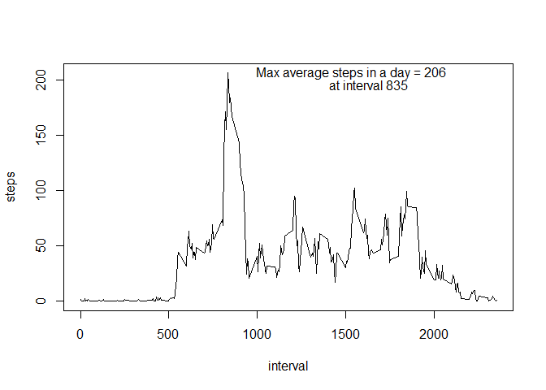

# Reproducible Research Course Project 1
Anil Bhat  
January 26, 2017  


### Assignment Summary
This assignment makes use of data from a personal activity monitoring device. This device collects data at 5 minute intervals through out the day. The data consists of two months of data from an anonymous individual collected during the months of October and November, 2012 and include the number of steps taken in 5 minute intervals each day.

The variables included in this dataset are:  
- steps: Number of steps taking in a 5-minute interval (missing values are coded as NA)  
- date: The date on which the measurement was taken in YYYY-MM-DD format  
- interval: Identifier for the 5-minute interval in which measurement was taken  

The dataset is stored in a comma-separated-value (CSV) file and there are a total of 17,568 observations in this dataset.

This assignment explores the data in multiple ways. 

### Histogram of total number of steps taken each day
First, we need to read the CSV data file and calculate the total number of steps taken each day while ignoring missing values. If you look at the dataset, there are values missing in the Steps column for an entire day thus making it easier to exclude them from our analysis. The histogram shows the distribution of the total number of steps taken each day.    

```r
library(graphics)

activity_df <- 
  read.csv("C:/Users/anbhat/Documents/Anil/Coursera Data Science Specialization/Reproducible Research/activity.csv")

sum_activity_df <- aggregate(steps ~ date, data = activity_df, FUN = sum, na.rm = TRUE)
hist(x = sum_activity_df$steps, 
     main = "Histogram of the total number of steps taken each day", 
     xlab = "Number of Steps")
```

<!-- -->

### Mean and median of the total number of steps taken each day
Using the total number of steps taken each day, we calculate the mean and the median

```r
mean_activity_df <- round(mean(sum_activity_df$steps, na.rm = TRUE), 0)
median_activity_df <- median(sum_activity_df$steps, na.rm = TRUE)
print(paste("Mean of the total number of steps taken each day =", mean_activity_df))
```

```
## [1] "Mean of the total number of steps taken each day = 10766"
```

```r
print(paste("Median of the total number of steps taken each day =", median_activity_df))
```

```
## [1] "Median of the total number of steps taken each day = 10765"
```

### Time series plot of the average number of steps taken per time interval
We can determine the average daily pattern of activity by calculating the mean of the number of steps by interval across all the days. Plotting the result helps us visualize the daily pattern of activity. We can also see which 5-minute interval, on average across all the days, contains maximum number of steps.

```r
mean_activity_df1 <- aggregate(steps ~ interval, data = activity_df, FUN = mean, na.rm = TRUE)
plot(mean_activity_df1, type = "l")
maxsteps_interval <- mean_activity_df1[mean_activity_df1$steps == max(mean_activity_df1$steps),]
text(x = maxsteps_interval[1,1] + 700, y = maxsteps_interval[1,2], labels = paste("Max average steps in a day =", round(maxsteps_interval[1, 2])))
text(x = maxsteps_interval[1,1] + 800, y = maxsteps_interval[1,2] - 10, labels = paste("at interval", maxsteps_interval[1,1]))
```

<!-- -->

### Number of missing values in the dataset
Since we know that there are several missing values in the dataset, let's find out how many rows have them

```r
#Function to be called multiple times in this document
num_missing <- function(act_df) {
  print(paste("Total number of missing values =", sum(is.na(act_df$steps))))
}

num_missing(activity_df)
```

```
## [1] "Total number of missing values = 2304"
```

### Histogram of total number of steps taken each day after imputing missing data
What is the impact of imputing missing data on the histogram? 

Let's try two ways of imputing missing data:  
- Method A: Take the mean of the total number of steps per day calculated above, and divide it by the number of observations per day. Since the observations are recorded every 5 mins, the total number of observations per day is (24 * 60) / 5 = 288.  
- Method B: Replace the missing values with the mean for each 5-min interval across all the days 

We need a common histogram plotting function to be called by the R code for each method.

```r
plot_hist <- function(act_df) {
  sum_activity_df1 <- aggregate(steps ~ date, data = act_df, FUN = sum, na.rm = TRUE)
  hist(x = sum_activity_df1$steps, 
     main = "Histogram of the total number of steps taken each day", 
     xlab = "Number of Steps")
}
```

**Method A: Using the mean of the total number of steps per day **

```r
activity_df1 <- activity_df   #Copy the dataset to a new data frame 
activity_df1[is.na(activity_df1$steps),]$steps <- mean_activity_df/288  #Replace missing values
```

Now, there should not be any missing values in the dataset

```r
num_missing(activity_df1)
```

```
## [1] "Total number of missing values = 0"
```

Now that the missing values have been replaced, let's calculate the total number of steps taken each day and plot the histogram.

```r
plot_hist(activity_df1)
```

<!-- -->

**Conclusion: The imputation using Method A causes the histogram to show more observations in the 50th percentile**

**Method B: Using the mean for each 5-min interval across all the days**

```r
activity_df1 <- activity_df   #Copy the dataset again
null_indexes <- which(is.na(activity_df1$steps))  #Find the rows containing missing values
#Replace each missing value with the mean number of steps for that interval
for (i in 1:length(null_indexes)) { 
  activity_df1[null_indexes[i],]$steps <- mean_activity_df1[mean_activity_df1$interval == activity_df1[null_indexes[i],]$interval, ]$steps
}
```

Now, there should not be any missing values in the dataset

```r
num_missing(activity_df1)
```

```
## [1] "Total number of missing values = 0"
```

Now that the missing values have been replaced, let's calculate the total number of steps taken each day and plot the histogram.

```r
plot_hist(activity_df1)
```

<!-- -->

**Conclusion: The imputation using Method B also causes the histogram to show more observations in the 50th percentile**

### Comparison of the average number of steps taken per 5-minute interval across weekdays and weekends
Let's look at the differences in activity patterns between weekdays and weekends. First, we need to determine which dates fall on weekends, and which ones fall on weekdays. Then, we need to calculate the mean for each interval across weekdays and weekends. The resulting data frame can be plotted to look at the differences in activity patterns between weekdays and weekends using the ggplot function.

```r
library(ggplot2)
for (i in 1:nrow(activity_df1)) {
  if(weekdays(as.Date(activity_df1[i,]$date)) %in% c("Saturday", "Sunday")) 
         activity_df1[i, "day"] <- "weekend"
     else 
         activity_df1[i, "day"] <- "weekday"
}

mean_activity_df2 <- aggregate(steps ~ day + interval, data = activity_df1, FUN = mean, na.rm = TRUE)

g <- ggplot(mean_activity_df2, aes(interval, steps))
p <- g + geom_line(aes(color = day)) +
  facet_grid(day ~ ., labeller = labeller(.cols = unique(mean_activity_df2$day))) + 
  labs(title = "Comparison of average number of steps by interval")
print(p)
```

<!-- -->
